# Multi-Task Robotic Manipulation in MuJoCo: Pushing, Grasping, and Obstacle Avoidance

This repository contains the implementation of a 6-DOF robotic manipulator designed to perform two sequential tasks: a-dual-object cooperative pushing task and a pick-and-place task over an obstacle in a simulated environment. The simulation is implemented in MuJoCo, and all controller logic and data collection are written in Python.

---

## 1. System Architecture and Physical Parameters

The simulation model is defined in `model.xml` and comprises the following components:
* **Robotic Manipulator:** A 6-DOF serial manipulator mounted on a fixed base. The kinematic structure includes a shoulder pan, shoulder lift, elbow, and three wrist joints, terminated by a parallel-jaw gripper.
* **Actuation and Control:** Proportional-Derivative (PD) controllers are implemented at the joint level via `position` actuators in the MJCF model.
* **Environment:** A $1.2\text{m} \times 0.8\text{m}$ flat surface (workbench) at a height of $0.8\text{m}$, divided by a central vertical partition (barrier) of height $0.27\text{m}$ located at $x = 0$.
* **Manipulated Objects:** Two cubes (red and blue, $5\text{cm}$ side length, mass $m = 0.1\text{kg}$) with contact parameters configured to represent typical laboratory materials (high friction coefficient $\mu = 1.5$ to prevent slippage during contact).

---

## 2. Control and Trajectory Planning

### Kinematics and Inverse Kinematics (IK)
End-effector path planning is specified in Cartesian space. To map desired Cartesian trajectories $\mathbf{x}_d(t)$ to joint space configurations $\mathbf{q}_d(t)$, a numerical Inverse Kinematics solver is implemented. The solver employs a Damped Least Squares (DLS) method (also known as Levenberg-Marquardt) to handle kinematic singularities:

$$\Delta\mathbf{q} = \mathbf{J}^T (\mathbf{J}\mathbf{J}^T + \lambda^2 \mathbf{I})^{-1} \mathbf{e}$$

where $\mathbf{J}$ is the analytic Jacobian of the end-effector site, $\mathbf{e}$ is the combined translation and orientation error vector, and $\lambda = 0.001$ is the damping factor. Joint limit constraints are enforced during the iterative updates.

To avoid local minima and bad joint configurations (such as "elbow-down" configurations resulting in collisions with the table), the manipulator's starting joint states are initialized to an optimized "elbow-up" configuration:
$$\mathbf{q}_{\text{init}} = [1.9890, 1.0226, 0.8796, 1.2394, 0.0, -1.1526]\text{ rad}$$

### Trajectory Interpolation
To minimize sudden accelerations and control effort, all path segments between waypoints use a minimum-jerk trajectory profile. The interpolation parameter $\alpha(t) \in [0, 1]$ is computed as a quintic polynomial in normalized time $\tau = t / T$:

$$\alpha(\tau) = 10\tau^3 - 15\tau^4 + 6\tau^5$$

---

## 3. Tasks and Execution Phases

### Task 1: Cooperative Pushing (Goal 3)
In the first phase of the experiment, the manipulator repositioned two blocks on the table:
1. **Pre-positioning:** The arm moves from its home configuration to a point directly behind the red block ($[-0.13, 0.6, 0.95]\text{m}$) and lowers to a pre-push height ($z = 0.855\text{m}$).
2. **Contact & Pushing:** The arm executes a linear sweep along the x-direction, colliding with the red block and pushing it into the blue block.
3. **Corner Delivery:** Both blocks are pushed together to the target region on the left side of the table ($[-0.40, 0.70, 0.855]\text{m}$).

| Initial Scene | Pre-Push | Mid-Push | Push Completed |
| :---: | :---: | :---: | :---: |
| 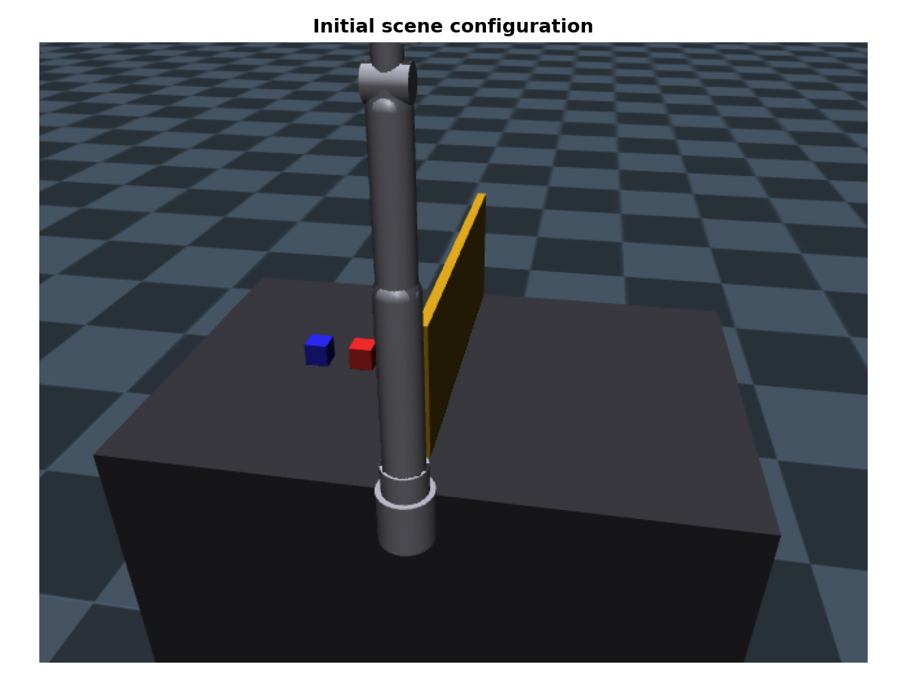 | 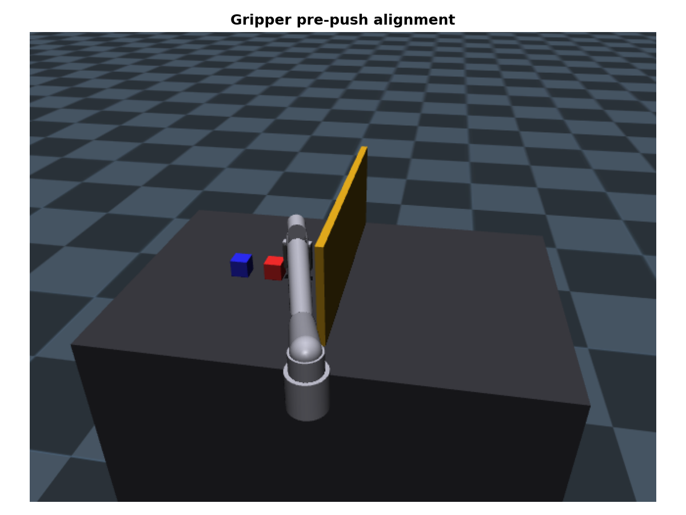 | 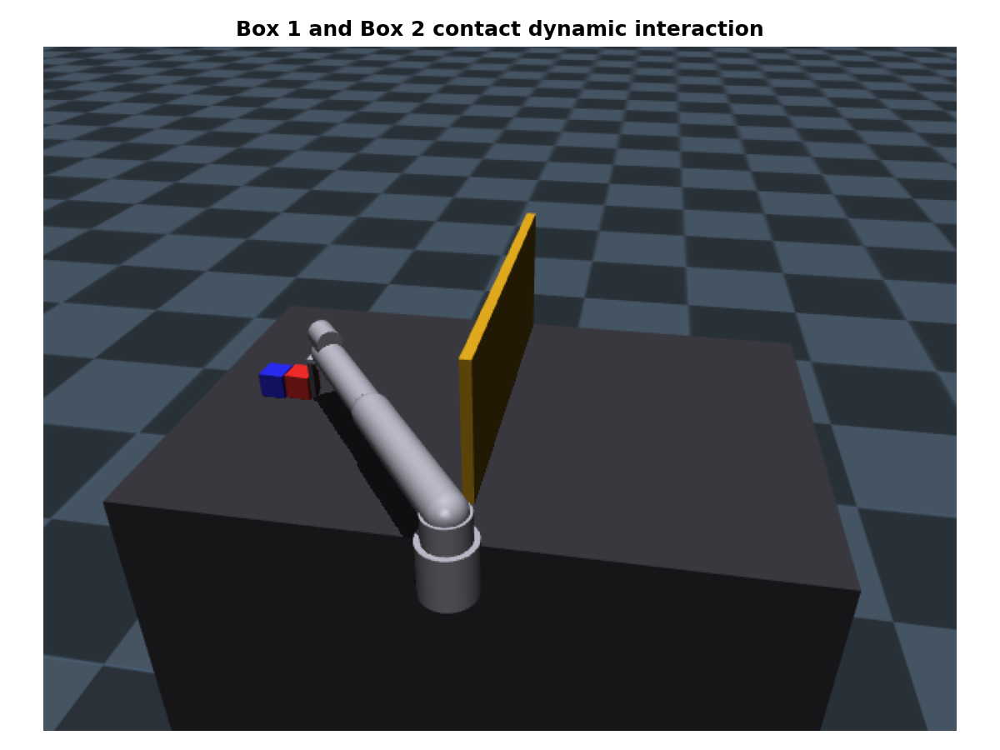 | 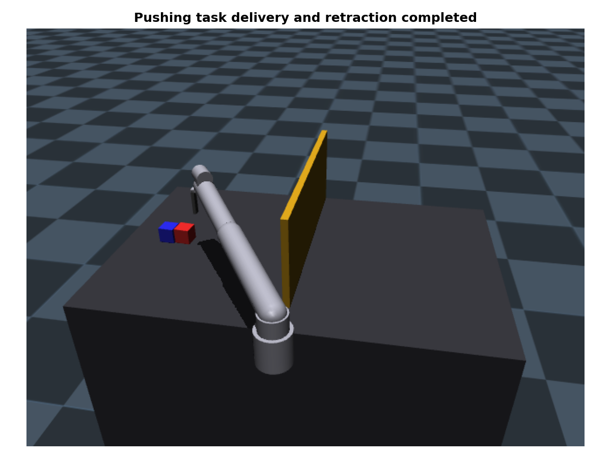 |

---

### Task 2: Pick-and-Place Over Barrier (Goal 4)
In the second phase, the arm picks up the red block and carries it over a central barrier:
1. **Pre-Grasp:** The arm positions the open gripper around the red block at $[-0.2, 0.6, 0.855]\text{m}$.
2. **Grasping:** The gripper closes on the block by driving the slide actuators to $0.024\text{m}$.
3. **Lifting & Transiting:** The arm lifts the block to a safe height of $1.0\text{m}$, translates forward ($y = 0.42\text{m}$), and crosses the barrier ($x = 0.2\text{m}$).
4. **Placement:** The arm lowers the block onto the right side of the table ($z = 0.855\text{m}$), opens the gripper, and retracts to a safe height.

| Pre-Grasp | Grasping | Lifting / Transiting | Placement | Post-Retraction |
| :---: | :---: | :---: | :---: | :---: |
| 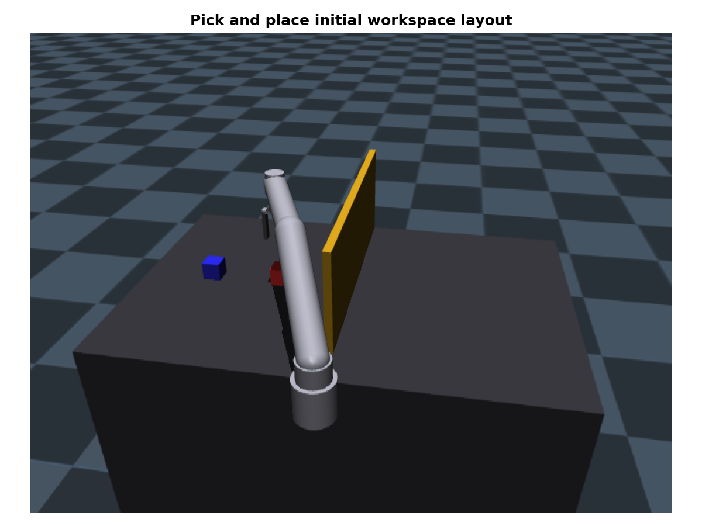 | 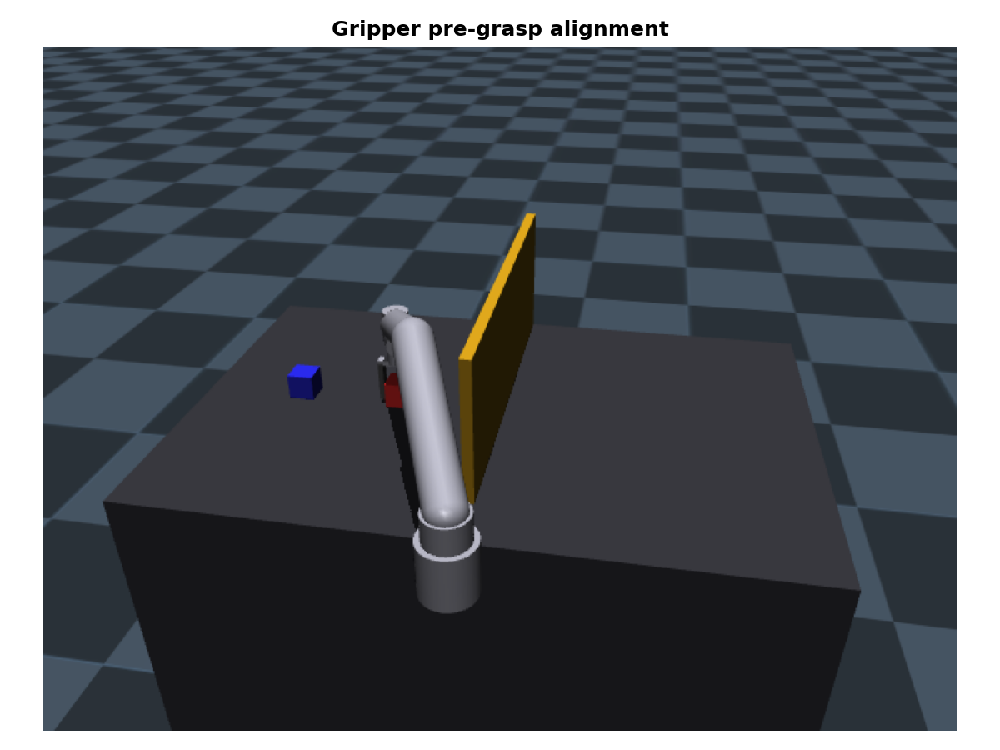 | 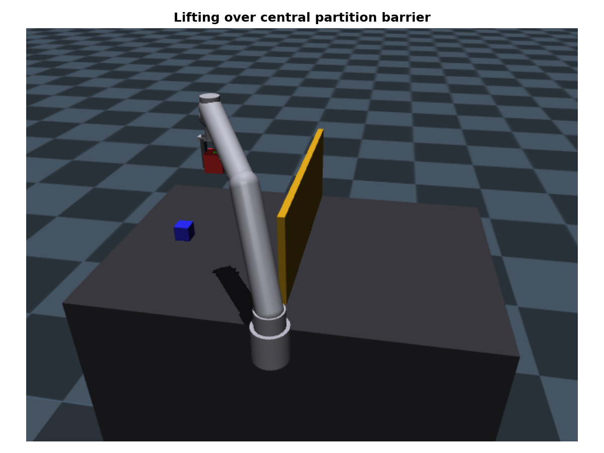 | 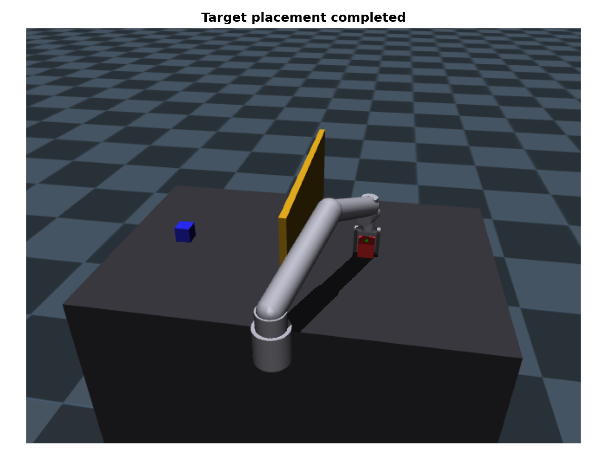 | 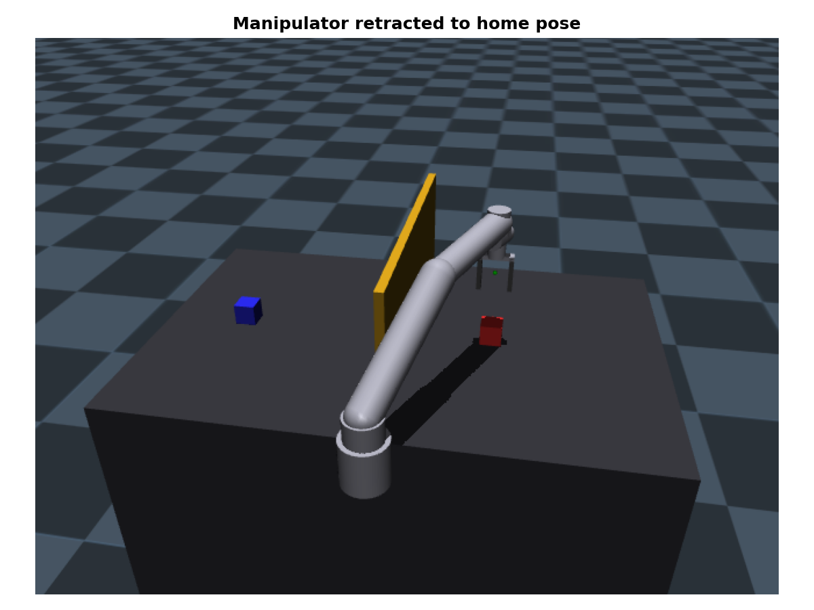 |

---

## 4. Telemetry and Sensor Data Analysis

Data was collected throughout both tasks at a frequency matching the simulation step ($500\text{ Hz}$).

### Object Trajectories
The trajectory plot illustrates the displacement of both blocks over time. The transition between the pushing phase (first 2 seconds) and the pick-and-place phase (after the coordinate reset at 2.2 seconds) is clearly visible.

<p align="center">
  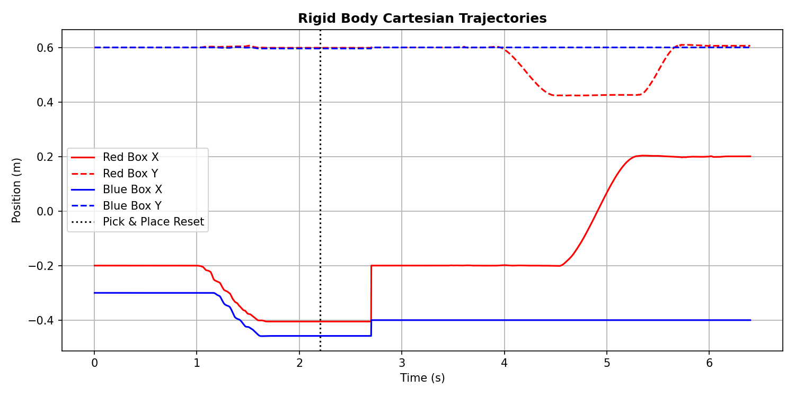
</p>

### Joint States & Actuator Torques
The joint angle trajectories show smooth, continuous changes, indicating that the minimum-jerk trajectory interpolation and the DLS IK solver successfully avoided joint-space discontinuities and singularities. The corresponding torque plots show transient spikes during high-acceleration phases and steady-state holding torques necessary to support the arm and payloads against gravity.

<p align="center">
  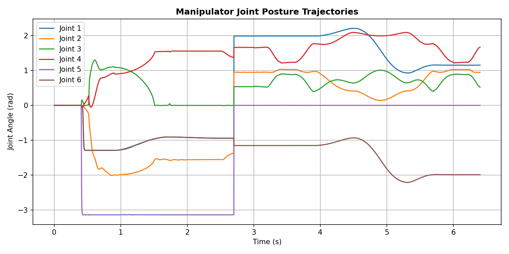
  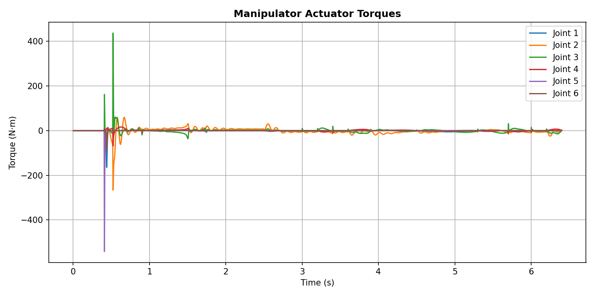
</p>

### IMU Accelerometer Data & Contact Forces
The IMU accelerometer on the red block records transient accelerations during the pushing phase and sustained gravitational acceleration ($~9.81\text{ m/s}^2$) when held aloft by the gripper. The contact force plot shows high-frequency force spikes corresponding to the collision during the push and the initial grasping impact, which drop to nominal levels during free-space transit.

<p align="center">
  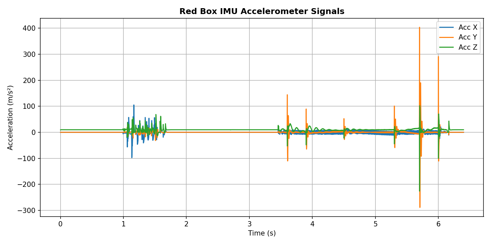
  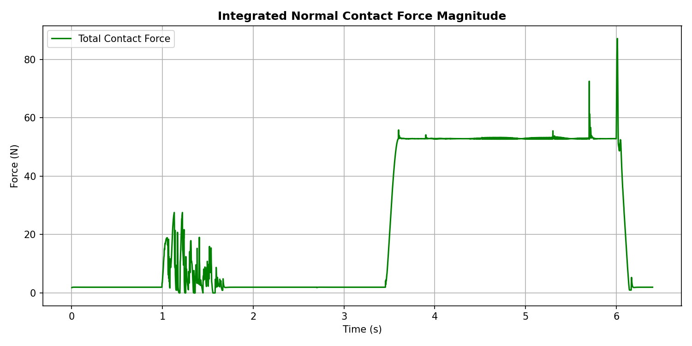
</p>

---

## 5. Sim-to-Real (Sim2Real) Transfer Challenges

Implementing this system on real hardware (e.g., to train a Vision-Language-Action model) introduces several challenges that must be addressed to minimize the reality gap:

* **Contact Dynamics Mismatch:** In the simulation, contact is modeled using soft constraint parameters (spring-damper approximations) which do not fully capture the micro-slippage, deformation, and surface friction variations present on physical workbenches.
* **Actuation Latency and Backlash:** Real robotic joints exhibit physical play (backlash), friction, and communication latencies. These delays can degrade the performance of closed-loop controllers tuned purely in simulation.
* **Visual Domain Shift:** The clean, well-lit simulation environment differs significantly from real laboratories, which contain variable lighting, background clutter (beakers, tubes), and camera lens distortions.

### Mitigation Strategies
1. **Dynamics Randomization:** Perturbing parameters like mass, friction coefficients, joint damping, and gravity during simulation-based policy training.
2. **Visual Domain Randomization:** Adding random noise, varying lighting angles/temperatures, and placing random objects in the scene during synthetic data generation.
3. Domain Adaptation Networks: Utilizing adversarial training or pre-trained features (e.g., DinoV2) to map real-world visual observations into a shared latent space that aligns with the simulation representations.

---

## 6. Setup and Execution

To set up the environment and run the simulation locally, follow the steps below:

### Prerequisites
* **Python**: Version 3.9 to 3.11 is recommended.
* **OS**: Windows, macOS, or Linux.

### Installation
1. **Clone the repository**:
   ```bash
   git clone https://github.com/AadityaBorse26/Corvinius.git
   cd Corvinius
   ```

2. **Create and activate a virtual environment**:
   * **Windows**:
     ```powershell
     python -m venv .venv
     .venv\Scripts\activate
     ```
   * **macOS/Linux**:
     ```bash
     python3 -m venv .venv
     source .venv/bin/activate
     ```

3. **Install dependencies**:
   ```bash
   pip install -r requirements.txt
   ```

### Running the Code
* **Run the main simulation**:
  This executes both the cooperative pushing and the pick-and-place tasks, collects telemetry data, captures phase screenshots, and outputs performance plots in the `output/` directory:
  ```bash
  python simulation.py
  ```

* **Run the contact dynamics checks**:
  This reports active contact geometries, forces, and spatial coordinates to verify the simulation's contact solver:
  ```bash
  python check_contacts.py
  ```

* **Run the diagnostics check**:
  This outputs real-time step-by-step joint, end-effector, and finger state diagnostics during a mock workspace pick-and-place operation:
  ```bash
  python check_eef_box.py
  ```

### Generated Outputs
After running `simulation.py`, the `output/` directory will be created containing:
1. **Screenshots** (`phase1_init.png` to `phase9_done.png`) visualizing the execution phases.
2. **Telemetry Plots**:
   * `plot_box_trajectories.png`: Cartesian displacement of the red and blue boxes.
   * `plot_joint_positions.png` & `plot_joint_torques.png`: Manipulator joint configuration and motor torque profile.
   * `plot_imu_accelerations.png` & `plot_contact_forces.png`: Inertial measurement readings and contact interaction forces.
